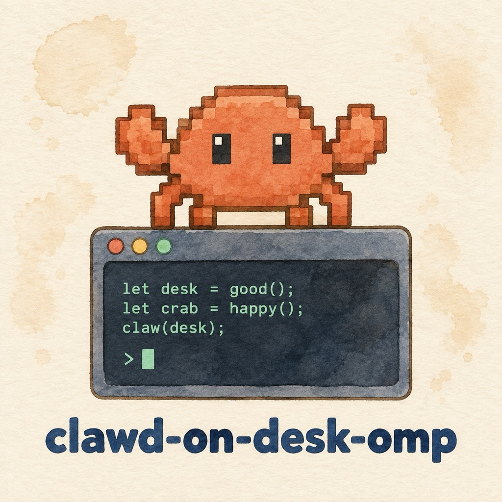
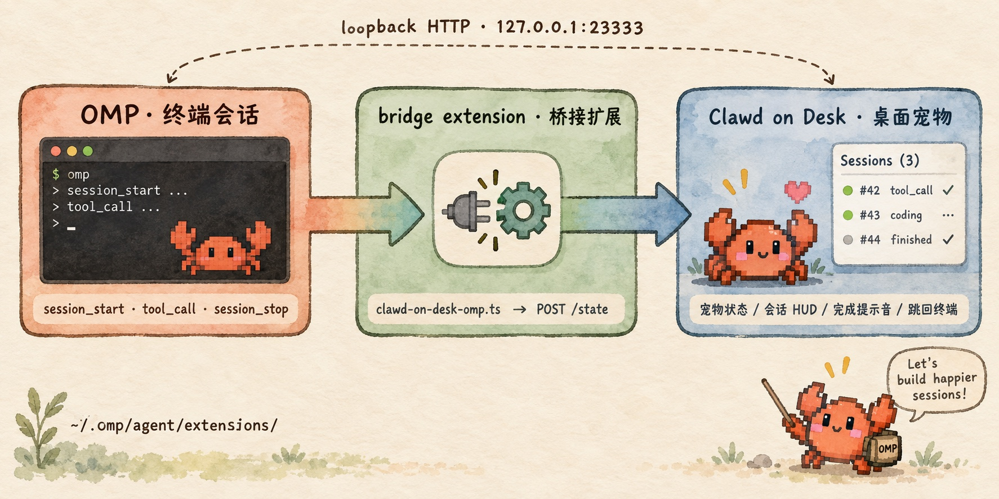

<div align="center">



# clawd-on-desk-omp

### 给桌面上的 Clawd 装上 OMP 的眼睛

<p>Clawd on Desk 内置了 20 多个 CLI agent 的适配，唯独没有 OMP。这个桥补上它：宠物状态、会话 HUD、完成提示音、一键跳回终端，全部可用。</p>

<p><b>English intro:</b> clawd-on-desk-omp bridges OMP (oh-my-pi) sessions into Clawd on Desk through its custom-application channel — desktop-pet state, session HUD, completion chime and jump-to-terminal, with zero modification to either side.</p>

<p>
  <a href="README.md"><b>中文</b></a>
  &nbsp;|&nbsp;
  <a href="README_EN.md"><b>English</b></a>
</p>

<p>
  <a href="#快速开始"><b>快速开始</b></a>
  &nbsp;·&nbsp;
  <a href="#事件映射"><b>事件映射</b></a>
  &nbsp;·&nbsp;
  <a href="#解决的痛点"><b>解决的痛点</b></a>
  &nbsp;·&nbsp;
  <a href="docs/protocol.md"><b>协议全貌</b></a>
</p>

<sub>OMP extension + Clawd custom application · macOS / Linux / Windows · 不改 Clawd 一行代码</sub>

</div>

---

<div align="center">

## 架构一览



</div>

---

## 一句话

Clawd on Desk 是闭源的 Electron 桌面宠物，用「自定义应用（custom application）」这个公开通道接纳它还没适配的 CLI agent：**注册一个可执行文件路径，然后任何本地进程往它的回环端点 POST 生命周期，就能拿到和内置 agent 同等的会话级 UI。**

这个仓库就是 OMP 那一侧的那一半。适配拆成两处，两边都不需要打补丁：

- **Clawd 侧（一次性，手工点几下）** —— 把 `omp` 可执行文件注册进去，Clawd 分配一个 agent id。
- **OMP 侧（一个文件）** —— `clawd-on-desk-omp.ts` 丢进 `~/.omp/agent/extensions/`，订阅 OMP 扩展事件并翻译成 Clawd 的状态。

---

## 解决的痛点

| 你以前的痛点 | clawd-on-desk-omp 怎么解 |
|---|---|
| 开着 OMP 跑长任务，去干别的就忘了它跑完没 | `session_stop` 触发完成提示音 + 宠物庆祝动画 |
| 同时开好几个 OMP 会话，不知道哪个在等你 | 每个交互会话在 Clawd 里独立一行，带会话名和当前工具 |
| 想回到某个会话，得在一堆终端标签里翻 | 上报 `source_pid` + `pid_chain`，Clawd 直接定位到对应 pane/tab |
| Clawd 内置适配里没有 OMP，感觉被落下了 | 走自定义应用通道，和内置 agent 同等待遇 |
| 自己写 hook 怕拖慢 agent、怕报错影响工具结果 | 250ms 超时 + 吞掉全部错误，上报永远不阻塞 OMP |
| 换台机器 / 换安装路径就失效 | agent id 三步解析：环境变量 → Clawd 已注册项 → 已知路径推导 |

---

## 核心特性

- **零侵入** —— Clawd 一行不改，OMP 只加一个扩展文件；两边升级都不会被这个桥卡住
- **完成信号只认已结算的回合** —— 用 `session_stop` 而非 `agent_end`，杜绝"后台还在跑却报完成"
- **agent id 自动解析** —— 环境变量 → 读 Clawd prefs 里已注册的项 → 已知路径推导，不硬编码
- **headless 静默** —— 子 agent / 后台 worker 不上报，交互会话才占一行
- **跳转可用** —— 解析终端祖先 pid 链，Ghostty / cmux / iTerm2 / Terminal / WezTerm / kitty / Warp 都能跳
- **失败即静默** —— 上报抛错只吞不抛，桌面监控绝不改变 OMP 的工具结果
- **可自检** —— `scripts/selftest.ts` 用 stub 传输验证事件映射，不往 Clawd 里塞幽灵会话

---

## 快速开始

### 1. 克隆 + 安装扩展

```bash
git clone https://github.com/Crosery/clawd-on-desk-omp.git
cd clawd-on-desk-omp
sh scripts/install.sh
```

`install.sh` 做的事：
- `cp` 扩展本体到 `~/.omp/agent/extensions/clawd-on-desk-omp.ts`（已存在则备份到 `.bak.<时间戳>`）
- 打印本机推导出的 agent id，以及 Clawd 侧还需要点什么

> 非默认 OMP 目录：`OMP_AGENT_DIR=/path/to/.omp/agent sh scripts/install.sh`

### 2. 在 Clawd 里注册 OMP

Clawd on Desk → **设置 → Agents → 自定义 / 未识别工具区** → 选择 `omp` 可执行文件。

Clawd 会分配一个形如 `custom-omp-<12位哈希>` 的 id，写进 `clawd-prefs.json` 的 `customApplications`。

**id 与「注册时的那个路径」绑定**（符号链接和真实路径结果不同），所以注册的是哪个路径，就用哪个路径启动 OMP。本机实测：

```
/Users/crosery/.bun/bin/omp   →   custom-omp-f83ec4ad2e8a
```

### 3. 校验

```bash
node scripts/agent-id.mjs          # 打印 agent id，并告诉你 Clawd 是否已接受它
bun scripts/selftest.ts            # 事件映射 + 端口发现 + Clawd health 端点（只读，不建会话）
curl -s http://127.0.0.1:23333/state   # {"ok":true,"app":"clawd-on-desk","port":23333}
```

然后**重启 OMP 会话**（扩展在会话启动时加载），Clawd 列表里就会出现 `OMP · <会话名>`。

如果 OMP 不是从注册路径启动的（wrapper 脚本、`bun link`、Windows shim），把 id 钉死：

```bash
export CLAWD_OMP_AGENT_ID=custom-omp-f83ec4ad2e8a
```

---

## 事件映射

| OMP 事件 | Clawd event | state | 说明 |
| --- | --- | --- | --- |
| `session_start` / `session_switch` / `session_branch` | `SessionStart` | `idle` | 会话建立或切换 |
| `before_agent_start` | `UserPromptSubmit` | `thinking` | 用户提交了输入 |
| `tool_call` | `PreToolUse` | `working` | 工具开始执行 |
| `tool_result` | `PostToolUse` / `PostToolUseFailure` | `working` / `error` | 失败走 error 动画 |
| `session_stop` | `Stop` | `attention` | **唯一**的"完成"信号：回合已结算 |
| `session_before_compact` | `PreCompact` | `sweeping` | 压缩中，扫地动画 |
| `session_compact` | `PostCompact` | `attention` | 压缩完成 |
| `session_shutdown` | `SessionEnd` | `sleeping` | 会话结束，宠物入睡 |

两个踩过的坑，写在源码注释里了：

- **完成事件必须用 `session_stop`，不能用 `agent_end`。** `agent_end` 在调度暂停时也会触发（后台任务还在跑、有排队的后续回合），用它会让 Clawd 在会话仍在工作时宣布"完成"。`session_stop` 表示回合真正结算，且不会为子 agent 会话触发。
- **会话标题优先用 OMP 的会话名。** 多个交互会话常共用同一个 cwd，若都用 `OMP · <目录>` 命名，Clawd 列表与跳转目标无法区分。

状态、事件、字段、端口发现、会话键编码的完整说明见 [`docs/protocol.md`](docs/protocol.md)——那是从 Clawd 1.0.0 的实际行为里逆向整理的。

---

## 能力边界

- **没有审批气泡。** 自定义应用在 Clawd 里是 state-only：`permissionsEnabled` 不被支持，权限审批仍是 Clawd 内置 hook（Claude Code / Codex / Kimi 等）的能力，OMP 不在其中。
- **跳转依赖终端。** Clawd 从上报的 `source_pid` + `pid_chain` 找到终端再定位 pane/tab；没有终端祖先 pid 的会话只能显示、不能跳。
- **协议是逆向整理的。** Clawd on Desk 是闭源第三方应用，端点与字段可能在版本间变化。本桥的失败模式是"什么都不发生"，永远不会影响 OMP 本身。
- **只上报交互会话。** `ctx.hasUI === false` 的 headless worker 一律跳过。

---

## 项目结构

```
clawd-on-desk-omp/
├── clawd-on-desk-omp.ts        OMP 扩展本体（install.sh 复制到 ~/.omp/agent/extensions/）
├── scripts/
│   ├── install.sh              安装 / 更新扩展，自动备份
│   ├── agent-id.mjs            推导并校验 Clawd 侧的 agent id
│   ├── selftest.ts             端到端自检：事件映射 + 端口 + 端点连通性
│   └── typecheck.sh            用本机 OMP 的类型定义做类型检查
├── docs/protocol.md            Clawd 自定义应用状态协议（逆向整理）
└── assets/                     README 用的 logo 与架构图
```

---

## 设计原则

1. **上报必须静默失败** —— 桌面监控是装饰，绝不能拖慢或改变 OMP 的工具结果
2. **完成只从已结算的回合发出** —— 循环边界事件不是完成事件
3. **只用公开的注册通道** —— 不改 Clawd 代码，不依赖未注册的路径，不猜 id
4. **一个交互会话一行** —— headless worker 不占 Clawd 的列表
5. **协议变化时优雅降级** —— 字段不认识就忽略，端点不通就什么都不发生

---

## 致谢与出处

Clawd on Desk 与 OMP (oh-my-pi) 均为各自作者的独立项目，本仓库非官方适配，协议文档为观察所得，与 Clawd on Desk 无隶属关系。

<div align="center">
<sub>MIT · 让桌面上的小螃蟹知道 OMP 在忙什么</sub>
</div>
